# Calm UI redesign

A visual and UX pass over the overlay, choices, settings, and setup. The
enforcement engine, persistence, and the Accessibility host are unchanged; the
overlay keeps its existing `BreakerOverlay` signature.

## Principles

- **The breath is the whole screen for the first eight seconds.** Then the orb
  draws back, the reflection arrives, and the choices rise — one idea at a time
  (staggered 150 / 650 / 950 ms; Pause fades in last).
- **Ink and ivory.** Two neutrals carry everything. Moss marks "on", brick marks
  "needs repair"; nothing else is colored. Dark theme follows the system — an
  ivory flash at night is the opposite of calm.
- **Serif for what asks something of you** (the reflection, page titles, the
  consent), system sans for everything operational.
- **Say what is true in plain words.** Rows read out their state ("Check-in
  every 10 min · weekdays · 9 AM–5 PM") so nothing has to be opened to be known.
- **Continue and Leave carry equal weight.** Neither is styled as the right answer.

## Overlay

- Numeric hard-lock countdown replaced by a thin progress arc around the orb
  and a "Breathe in / Breathe out" cue synced to the orb (4 s each way,
  anchored to the breaker's start). Reduced motion: still orb, "Breathe slowly".
- Continue's wait lives in the button itself ("Continue in 9s").
- Trigger reads as "Opening" / "Checking in" under the app name.
- Redirects are icon tiles under an "Or go to" label.
- Pause stays top-right; exhausted and notification-less states are explicit.
- Layout: stacked in portrait (choices within thumb reach), side-by-side in
  landscape, scrollable at large text sizes; short split-screen windows shrink
  the orb and drop the cue.

## Settings and setup

- **Welcome** is one page: what it does, what it sees, what the first eight
  seconds do, what it keeps.
- **Home** is also the setup checklist: its title is the status ("Off for now",
  "Needs attention", "Ready when you are", "On for 3 apps"), followed by the one
  next action, then Apps, Defaults, and Reliability.
- **Defaults** — breath slider with a large readout, redirects as four visible
  slots, schedule as Always on / Scheduled with day toggles and time pickers.
- **App** — check-in toggle and interval, schedule Default / Always on /
  Custom, redirects Default / Custom, a note on what stays global, and
  "Stop pausing <app>".
- **Pickers** are full screens with search; the redirect picker shows the four
  slots filling as you choose.

## Behavior changes worth checking

These are presentation-level, but they change what a tap does:

1. A new schedule (global or per-app Custom) starts at weekdays 9 AM–5 PM
   instead of an empty week, which silently enforced nothing.
2. Times are set with the Material time picker instead of typed HH:MM. Picking
   00:00 as an end time stores 24:00 (end of day), which covers the same minutes.
3. Per-app Custom schedule starts from the global schedule when one exists.
4. The redirect picker is a full-screen page instead of a dialog; Clear remains.
5. "Pause notifications" asks for permission once, then opens system settings.
6. App settings gained "Stop pausing <app>" (same effect as unchecking it in
   the picker).
7. The app and overlay follow system dark mode.

Unchanged and deliberately out of scope: the choice-acknowledgment toast,
haptics, One Hand Operation compatibility.

## Screenshots

Rendered headlessly from `Previews.kt` by `GalleryScreenshotTest` (Robolectric
native graphics + Roborazzi) at 412×915 dp, xxhdpi. App icons render as
monograms there; on a phone they are the real icons. The breath is held still
at the instant each sample implies (`LocalStillBreath`), since an endless
animation never lets the test clock settle.

```sh
export ANDROID_SDK_ROOT=/usr/lib/android-sdk JAVA_HOME=/usr/lib/jvm/java-17-openjdk-amd64
./gradlew :app:testDebugUnitTest --tests '*GalleryScreenshotTest*' \
  --no-daemon --no-configuration-cache --max-workers=1
```

| Overlay | |
|---|---|
| 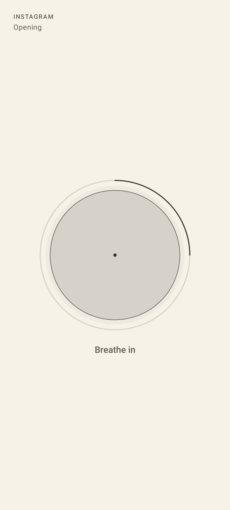 Hard lock: breath only | 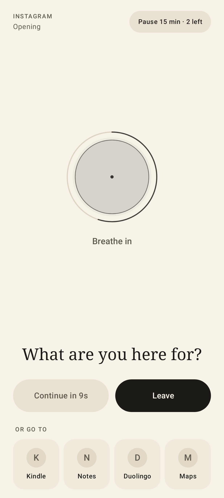 Choices; Continue waiting |
| 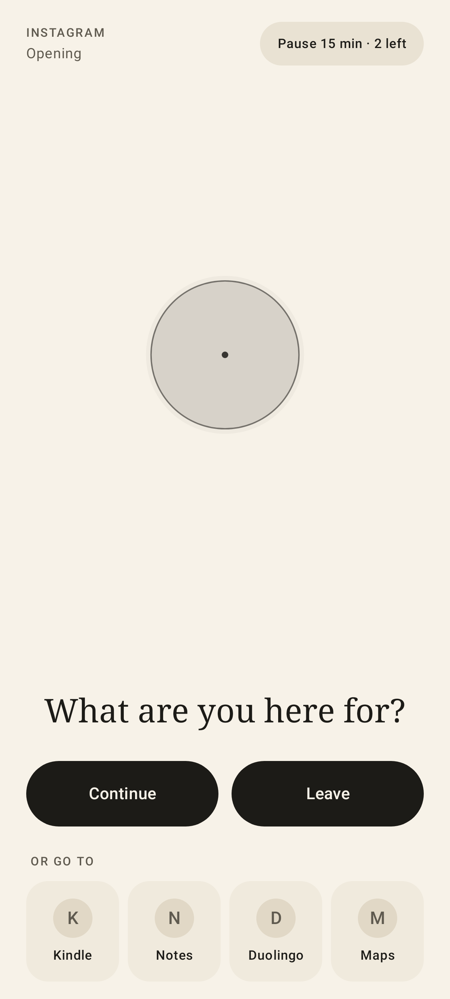 Breath complete | 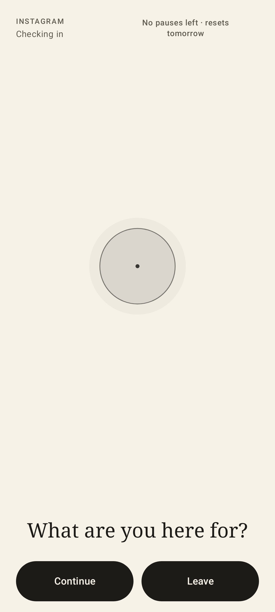 Check-in, no redirects, pauses spent |
| 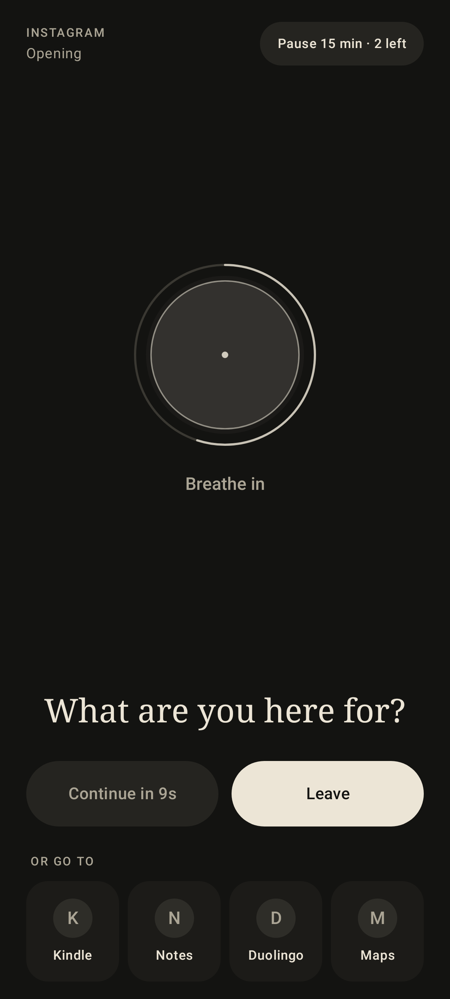 Dark | 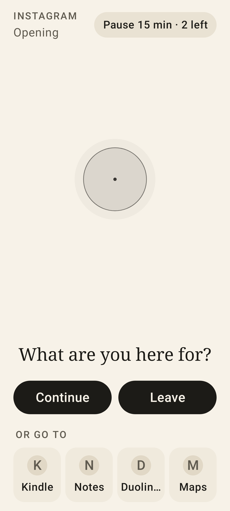 160% text |
| 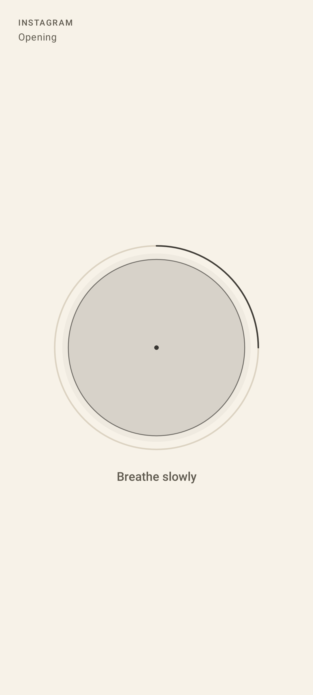 Reduced motion | |

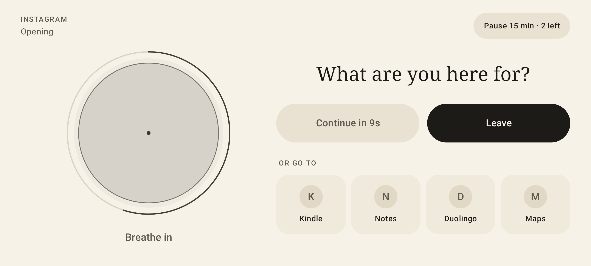

| Setup | |
|---|---|
| 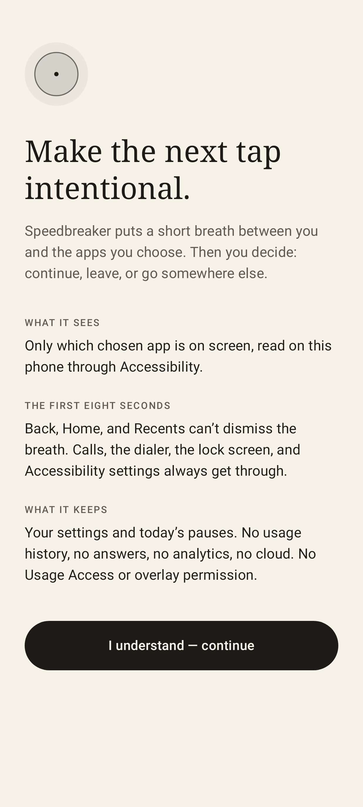 Welcome | 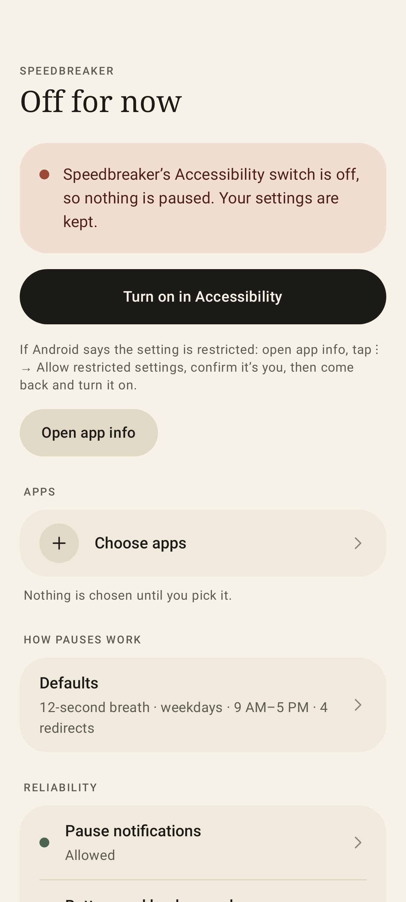 Accessibility off |
| 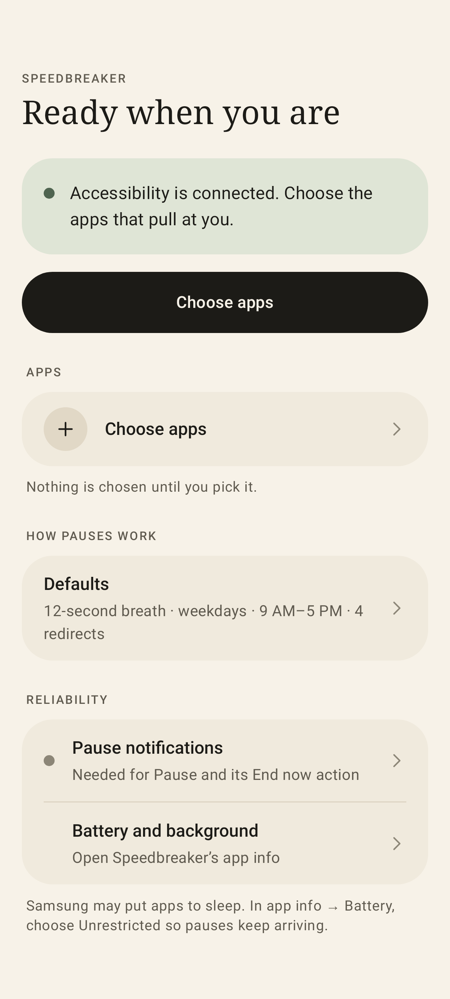 Connected, no apps | 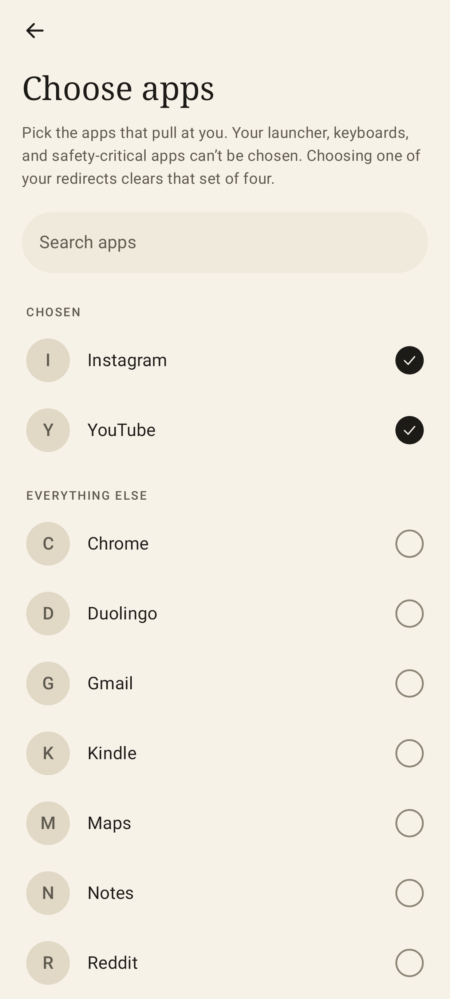 Choose apps |

| Settings | |
|---|---|
| 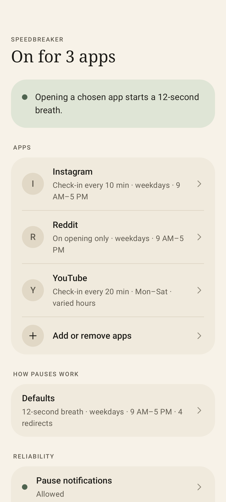 Home | 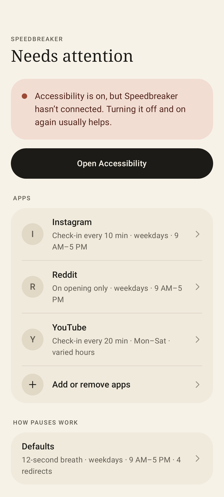 Needs attention |
| 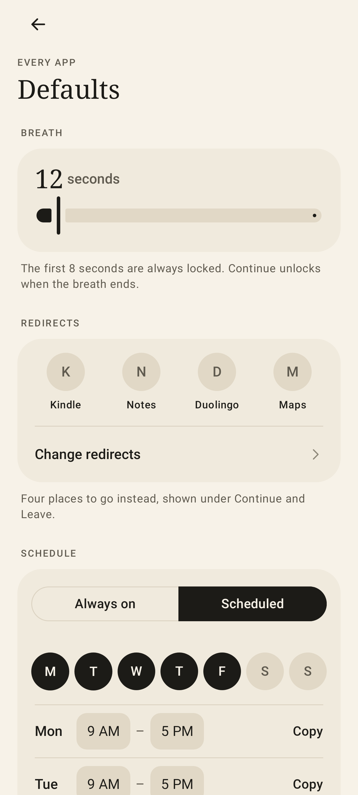 Defaults | 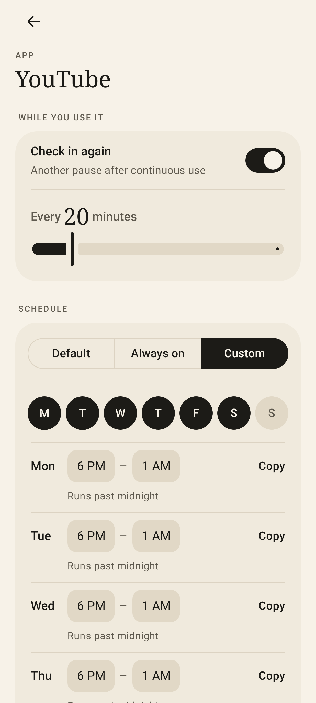 One app |
| 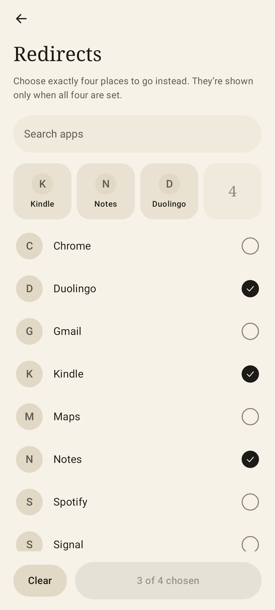 Redirect picker |  Dark |
| 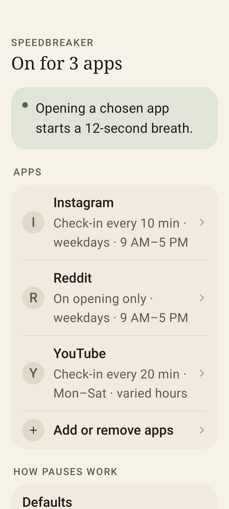 160% text | |
